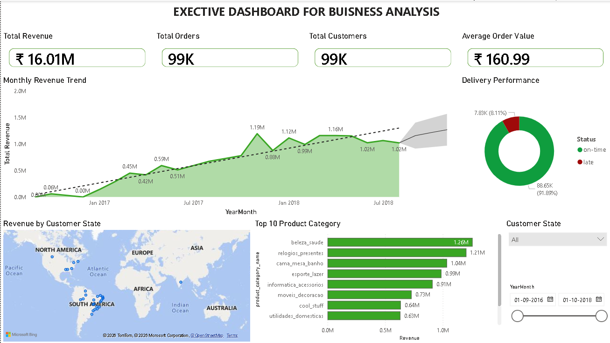
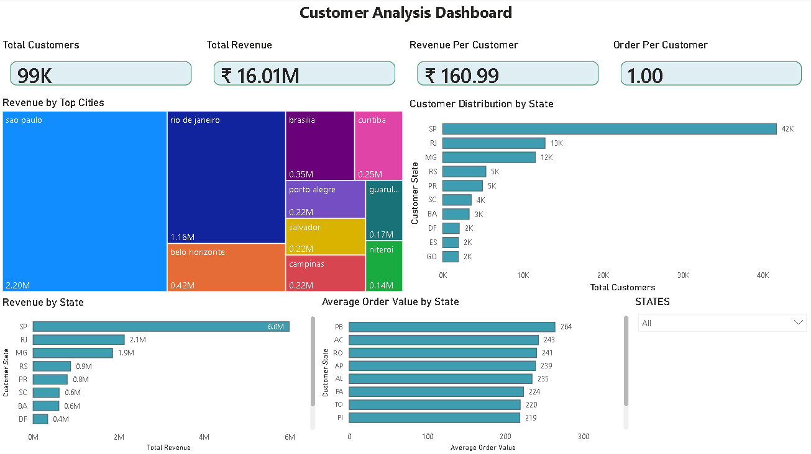
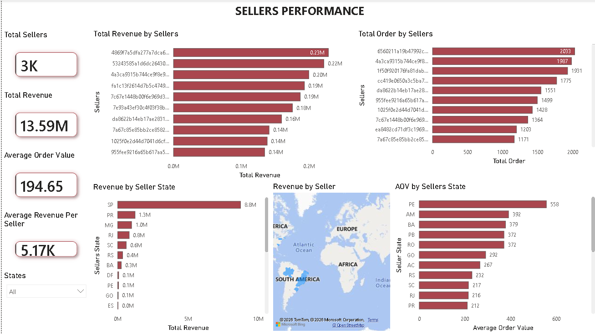
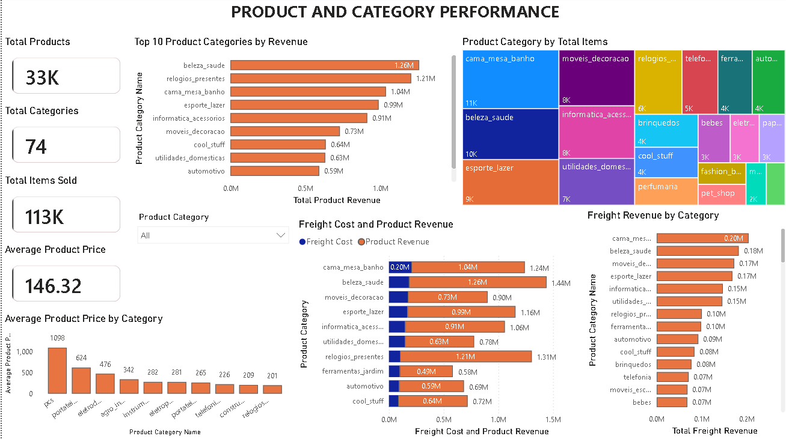

# 📊 Olist E-Commerce Executive Dashboard


A 4-page executive dashboard built in **Power BI** using the [Olist Brazilian E-Commerce public dataset](https://www.kaggle.com/datasets/olistbr/brazilian-ecommerce) from Kaggle. The dashboard provides a full 360° view of business performance — covering revenue trends, customer behaviour, seller performance, and product analytics — designed for executive-level decision making.

---

## 📥 Download Dashboard File

> The `.pbix` file exceeds GitHub's 25MB limit and is hosted on Google Drive.

👉 **[Download EXECUTIVE_DASHBOARD.pbix from Google Drive](https://drive.google.com/file/d/1zHMxoFTmfi5Mc7VTe8sfI1iNRerO-ulh/view?usp=sharing)**

Open in [Power BI Desktop](https://powerbi.microsoft.com/desktop/) *(free)* and connect to your MySQL database or CSV files to load the data.

---

## 📸 Dashboard Preview

### Page 1 — Overview


### Page 2 — Customer Analytics


### Page 3 — Seller Analytics


### Page 4 — Product Analytics


---

## 📄 Dashboard Pages

### 1️⃣ Overview
*Top-level business health at a glance.*

| KPIs | Visuals |
|---|---|
| Total Revenue | Monthly Revenue Trend (Line Chart) |
| Total Orders | Top 10 Product Categories by Revenue (Bar Chart) |
| Total Customers | Revenue by Customer State (Map) |
| Average Order Value | Delivery Performance (Donut Chart) |

**Slicers:** Customer State · Date (YearMonth)

---

### 2️⃣ Customer Analytics
*Where customers are, what they spend, and how often they order.*

| KPIs | Visuals |
|---|---|
| Total Customers | Revenue by Top Cities (Treemap) |
| Total Revenue | Customer Distribution by State (Bar Chart) |
| Revenue Per Customer | Revenue by State (Bar Chart) |
| Order Per Customer | Average Order Value by State (Bar Chart) |

**Slicers:** State

---

### 3️⃣ Seller Analytics
*Seller performance across revenue, orders, and geography.*

| KPIs | Visuals |
|---|---|
| Total Sellers | Total Revenue by Sellers (Bar Chart) |
| Total Revenue | Total Orders by Sellers (Bar Chart) |
| Average Order Value | Revenue by Seller State (Bar Chart) |
| Average Revenue Per Seller | AOV by Seller State (Bar Chart) |
| | Revenue by Seller State (Filled Map) |

---

### 4️⃣ Product Analytics
*Category-level performance, pricing, and freight insights.*

| KPIs | Visuals |
|---|---|
| Total Products | Top 10 Categories by Revenue (Bar Chart) |
| Total Categories | Product Category by Total Items (Treemap) |
| Total Items Sold | Average Product Price by Category (Combo Chart) |
| Average Product Price | Freight Revenue by Category (Bar Chart) |
| | Freight Cost vs Product Revenue (Stacked Bar) |

**Slicers:** Product Category

---

## 🗃️ Dataset

**Source:** [Olist Brazilian E-Commerce — Kaggle](https://www.kaggle.com/datasets/olistbr/brazilian-ecommerce)

The Olist dataset contains ~100,000 orders from a Brazilian e-commerce marketplace, covering 2016–2018. It includes order status, payment values, freight costs, customer and seller locations, and product category details.

### Tables Used

| Table | Description |
|---|---|
| `olist_orders` | Order-level data including status and timestamps |
| `olist_order_payments` | Payment values and order-level revenue |
| `olist_order_items` | Item-level price and freight data |
| `olist_customers` | Customer IDs and state/city location |
| `olist_sellers` | Seller IDs and location |
| `olist_products` | Product IDs and category names |
| `olist_clean` (views) | Cleaned and aggregated views built in MySQL |

---

## 🔧 Data Preparation & Architecture

Raw Kaggle CSVs were imported into **MySQL Workbench**, cleaned, and structured as views before connecting to Power BI:

- Imported all raw Olist CSVs into MySQL as base tables
- Created SQL views for cleaned and aggregated data (`olist_clean` schema)
- Connected Power BI directly to MySQL (`localhost:3306`) using MySQL connector
- Built measures and KPIs in Power BI using DAX on top of the MySQL views
- Classified delivery status by comparing `order_estimated_delivery_date` vs `order_delivered_customer_date`

---

## 📐 Data Model

Power BI connects directly to **MySQL Workbench** (`localhost:3306`, databases: `olist` and `olist_clean`). The clean schema contains pre-aggregated views for sellers, categories, revenue over time, and delivery performance — optimising query speed inside Power BI.

---

## 📏 Key DAX Measures

```dax
-- Total Revenue
Total Revenue = SUM(olist_clean_order_payments[payment_value])

-- Total Orders
Total Orders = DISTINCTCOUNT(olist_clean_order_payments[order_id])

-- Total Customers
Total Customers = DISTINCTCOUNT(olist_clean_customers[customer_id])

-- Average Order Value
Avg Order Value = DIVIDE([Total Revenue], [Total Orders])

-- Revenue Per Customer
Revenue Per Customer = DIVIDE([Total Revenue], [Total Customers])

-- Total Sellers
Total Sellers = DISTINCTCOUNT(olist_clean_sellers_performance[seller_id])

-- Average Revenue Per Seller
Average Revenue Per Seller = DIVIDE([Total Revenue], [Total Sellers])
```

---

## 💡 Key Business Insights

- **São Paulo** dominates all geographic metrics — highest customer count, highest revenue, and most active sellers by state
- **Delivery performance** reveals a notable proportion of late deliveries, signalling a logistics gap worth investigating
- A small number of **top sellers** drive a disproportionately large share of platform revenue — classic long-tail distribution
- **Furniture and home décor** categories carry significantly higher freight costs relative to product revenue compared to books and accessories
- **Health & beauty** and **watches & gifts** are consistently top-performing categories by both revenue and units sold

---

## 🛠️ Tools Used

| Tool | Purpose |
|---|---|
| Power BI Desktop | Dashboard development and DAX measures |
| MySQL Workbench | Data storage, cleaning, and SQL views |
| Python / Pandas | Initial data exploration |
| Kaggle | Dataset source |

---

## 🚀 How to Open

1. Download and install [Power BI Desktop](https://powerbi.microsoft.com/desktop/) *(free)*
2. Download the `.pbix` file from the **Google Drive link above**
3. Open the file in Power BI Desktop
4. Go to **Home → Transform Data → Data Source Settings**
5. Update the MySQL connection to point to your local MySQL instance
6. Enter your MySQL credentials and click **Refresh**

> **Note:** You will need MySQL Workbench with the Olist dataset imported locally to fully refresh the data. Alternatively, download the raw CSVs from [Kaggle](https://www.kaggle.com/datasets/olistbr/brazilian-ecommerce) and reconnect via CSV.

---

## 📁 Repository Structure

```
├── screenshots/
│   ├── overview.png
│   ├── customer_analytics.png
│   ├── seller_analytics.png
│   └── product_analytics.png
└── README.md

📎 EXECUTIVE_DASHBOARD.pbix → hosted on Google Drive (link above)
```

---

## 🙋 About

Built by **Syed Najaf** as a portfolio project demonstrating business intelligence and data visualisation skills.

- 🔗 [LinkedIn](https://www.linkedin.com/in/syed-najaf-54b100294/)
- 🐙 [GitHub](https://github.com/syednajaff) 

---

## 📜 License

Dataset sourced from Kaggle under [CC BY-NC-SA 4.0](https://creativecommons.org/licenses/by-nc-sa/4.0/). This dashboard is built for educational and portfolio purposes only.
